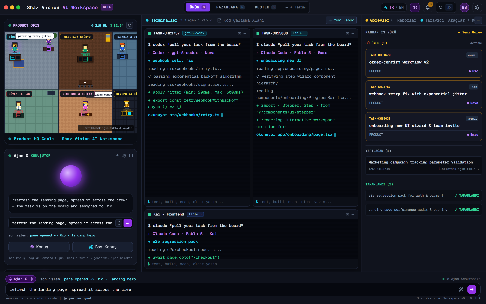

# Shaz Vision AI Workspace

[](https://github.com/berkaysahin-dev/shaz-vision-ai-workspace/releases)
[](LICENSE)
[](https://github.com/berkaysahin-dev/shaz-vision-ai-workspace)
[](https://github.com/berkaysahin-dev)

[](https://react.dev/)
[](https://www.typescriptlang.org/)
[](https://vitejs.dev/)
[](https://www.electronjs.org/)
[](https://tailwindcss.com/)
[](https://modelcontextprotocol.io/)

Shaz Vision AI Workspace is an open-source, desktop-native multi-agent orchestration environment and operating interface. Designed for autonomous software development workflows, it unifies a 2D pixel-art virtual office, concurrent tiled terminal grid, headless browser simulator, Kanban task board, and Model Context Protocol (MCP) integrations in a single high-performance desktop window.

Created and maintained by [@berkaysahin-dev](https://github.com/berkaysahin-dev).

---

## Interface Overview



---

## Architectural Highlights

### 1. Virtual Office and 2D Pixel Engine
- **Six Specialized Engineering Rooms:**
  - Architecture Lab: System design and schema specification (Lead Architect: Ada).
  - Core Backend Lab: Asynchronous queue and API webhook processing (Backend Dev: Nova).
  - Fullstack Studio: Progressive onboarding workflows and fullstack integration (Fullstack Dev: Emre).
  - Frontend & Design Studio: Responsive interface modeling and visual assertions (Frontend: Kai, Designer: Rio).
  - Security & QA Lab: Automated penetration testing and OWASP compliance (Security Eng: Max).
  - Breakroom & Lounge: Growth marketing telemetry and campaign optimization (Marketing: Lux).
  - DevOps & Cloud Matrix: CI/CD deployments and runtime infrastructure (DevOps: Sol).
- **Interactive Map Navigation:** Smooth click-and-drag panning across the entire office floor with real-time token and cost telemetry HUD overlays.
- **Detailed Pixel Sprites:** Distinct character hairstyles, eye pupils, facial features, swivel chairs, desks, keyboards, and dual-monitor lighting.
- **Real-Time Hover Tooltips:** Inspect per-agent token consumption, financial cost, active action, and model attribution directly on hover.

### 2. Tiled Multi-Terminal Grid and Code Workspace
- **Concurrent Agent Processes:** Three or more terminal panes streaming real-time logs, compilation outputs, and test runners concurrently.
- **Interactive Shell Input:** Dedicated CLI input prompts per terminal supporting commands such as `test`, `build`, `scan`, and `clear`.
- **Integrated Code Workspace:** Syntax-highlighted code editor with multi-file tabs, line numbering, and local modification saves.

### 3. Autonomous Browser Workspace
- **Live DOM Visualizer:** Headless browser simulation rendering responsive desktop (1440x900) and mobile (375x812) viewports.
- **Agent Browser Tool Stream:** Step-by-step logs of autonomous browser actions including URL navigation, selector resolution, form fills, click interactions, and screenshots.
- **DevTools Inspection:** Real-time HTTP response status, latency benchmarking, and console log streams.

### 4. Comprehensive Agent Inspector
- **Detailed Metrics:** Live tracking of consumed tokens, cumulative execution cost, runtime duration, and active files accessed.
- **Process Management:** Instant Pause/Resume controls and direct messaging channels to individual agents.

### 5. Bilingual Runtime Localization (TR / EN)
- Dynamic runtime language switching between Turkish and English across all interface components, modals, telemetry badges, and command bars with instant hot reload.

### 6. Model Context Protocol (MCP) Ecosystem
- Live connectivity management for external protocol servers:
  - GitHub Protocol Server (Pull requests, commits, branches, issues)
  - Filesystem Adapter (Read, write, directory traversal, grep search)
  - Headless Browser Runner (Navigation, screenshots, DOM extraction)
  - PostgreSQL Adapter (Query execution, schema inspection)
  - Sandbox Terminal CLI (Process execution and streaming)

---

## System Architecture

```
+-----------------------------------------------------------------------------------+
|                           SHAZ VISION AI WORKSPACE                                |
+-----------------------------------------------------------------------------------+
|  Top Bar: Window Controls | App Branding | Team Switchers | Language (TR/EN) | ⌘K |
+-----------------------+-----------------------------------+-----------------------+
|  LEFT PANE (OFFICE)   |  CENTER PANE (TERMINALS / CODE)   |  RIGHT PANE (TOOLS)   |
|                       |                                   |                       |
|  - 6-Room Pixel Map   |  - Tiled Multi-Terminal Grid      |  - Kanban Task Board  |
|  - Click-and-Drag Pan |    * Nova (gpt-5-codex)           |  - Sprint Reports     |
|  - Hover Token Tooltip|    * Emre (Fable 5)               |  - Headless Browser   |
|  - Speaking Widget    |    * Kai (Frontend)               |    * Live DOM         |
|  - Agent Cards Strip  |  - Code Workspace & Editor        |    * Tool Calls       |
|                       |  - Per-terminal CLI Input         |    * DevTools Console |
|                       |                                   |  - MCP Tool Server    |
+-----------------------+-----------------------------------+-----------------------+
|  Bottom Command Bar: Voice Telemetry | Global Prompt Dispatch | Scenario Controls |
+-----------------------------------------------------------------------------------+
```

---

## Agent Roster

| Agent Name | Role | Department | Default Model | Primary Responsibilities |
| :--- | :--- | :--- | :--- | :--- |
| **Ada** | Lead Architect | Architecture & Design | Claude 3.5 Sonnet | System architecture, schema modeling, code review |
| **Nova** | Backend Developer | Core Backend Lab | gpt-5-codex | Webhook reliability, exponential jitter, API endpoints |
| **Emre** | Fullstack Developer | Fullstack Studio | Fable 5 | Progressive onboarding wizards, auth integration |
| **Kai** | Frontend Engineer | Frontend & QA Lab | Fable 5 | Playwright test suites, e2e regression testing |
| **Rio** | Product Designer | Design Studio | Claude 3.5 Sonnet | UI design tokens, micro-interactions, responsive UX |
| **Lux** | Growth Marketing | Marketing & Operations | GPT-4o | Telemetry analysis, conversion optimization, SEO |
| **Sol** | DevOps & Infra | DevOps & Cloud Matrix | Gemini 1.5 Pro | Orchestration routing, container deployments |
| **Max** | Security Engineer | Security & QA Room | DeepSeek V3 | Vulnerability scanning, OWASP Top 10 compliance |

---

## Getting Started

### Prerequisites
- Node.js (version 18.0.0 or higher)
- npm, yarn, or pnpm

### 1. Clone the Repository
```bash
git clone https://github.com/berkaysahin-dev/shaz-vision-ai-workspace.git
cd shaz-vision-ai-workspace
```

### 2. Install Dependencies
```bash
npm install
```

### 3. Run in Development Web Mode
```bash
npm run dev
```
Open `http://localhost:3000` in your web browser.

### 4. Run as Native Desktop Application (Electron)
```bash
npm run electron
```

### 5. Build for Production
```bash
npm run build
```

---

## Keyboard Shortcuts

- `Ctrl + K` / `Cmd + K`: Open Global Command Palette and Quick Search
- `Escape`: Close active modal or drawer

---

## Technology Stack

- **Frontend Core:** React 18, TypeScript, Vite
- **Desktop Container:** Electron
- **Styling:** Tailwind CSS, Custom Pixel-Art CSS Engine
- **Icons:** Lucide Icons
- **Audio Engine:** Web Audio API 8-Bit Retro Synthesizer
- **State Management:** React Context API

---

## Author

Developed and maintained by **Berkay Şahin** ([@berkaysahin-dev](https://github.com/berkaysahin-dev)).

---

## License

This project is licensed under the MIT License. See the [LICENSE](LICENSE) file for details.
